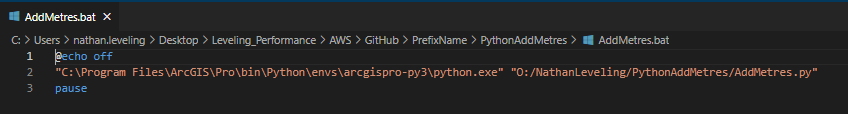
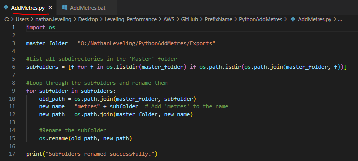
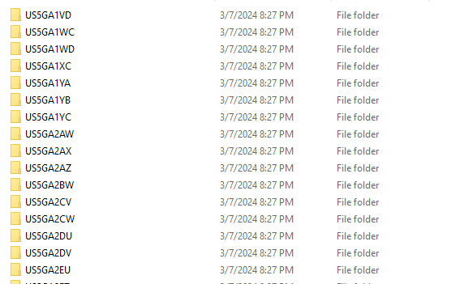
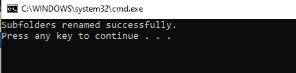
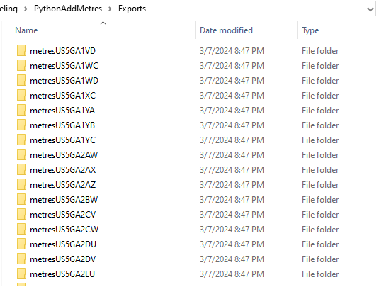

# Python-to-automate-common-prefix-name-to-folders
This script automates the addition of a common prefix folder name to multiple folders at once. It is an automated batch folder naming tool.

## Purpose 
This tool can be used to when you have numerous files that have unique names, but require a commone prefix. Instead of changing each folder, this tool automates the addition of the prefix in a batch process. 

## Important Files
- /AddMetres.bat (This can be used to call the python script to run when needed. Inputs are the python run env location, and the folder where the script lives.)

  
  
- /AddMetres.py (This is the script that renames the folders with the designated prefix)

   
  
- /ReadMe.txt (Additional Information)

## Before running Bat file

## Run Bat File

## After running Bat file

